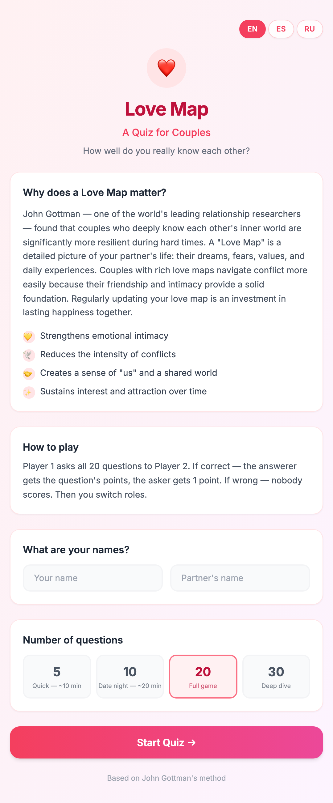
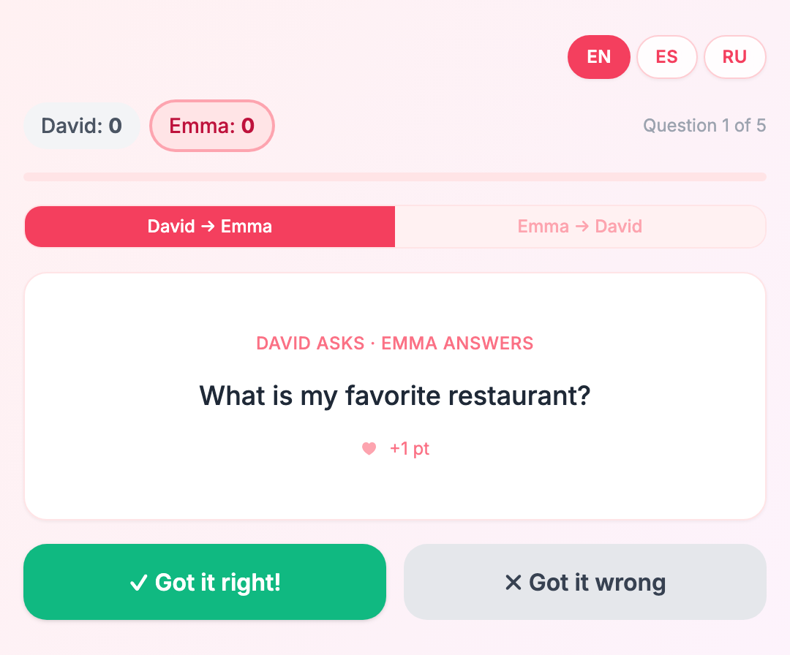
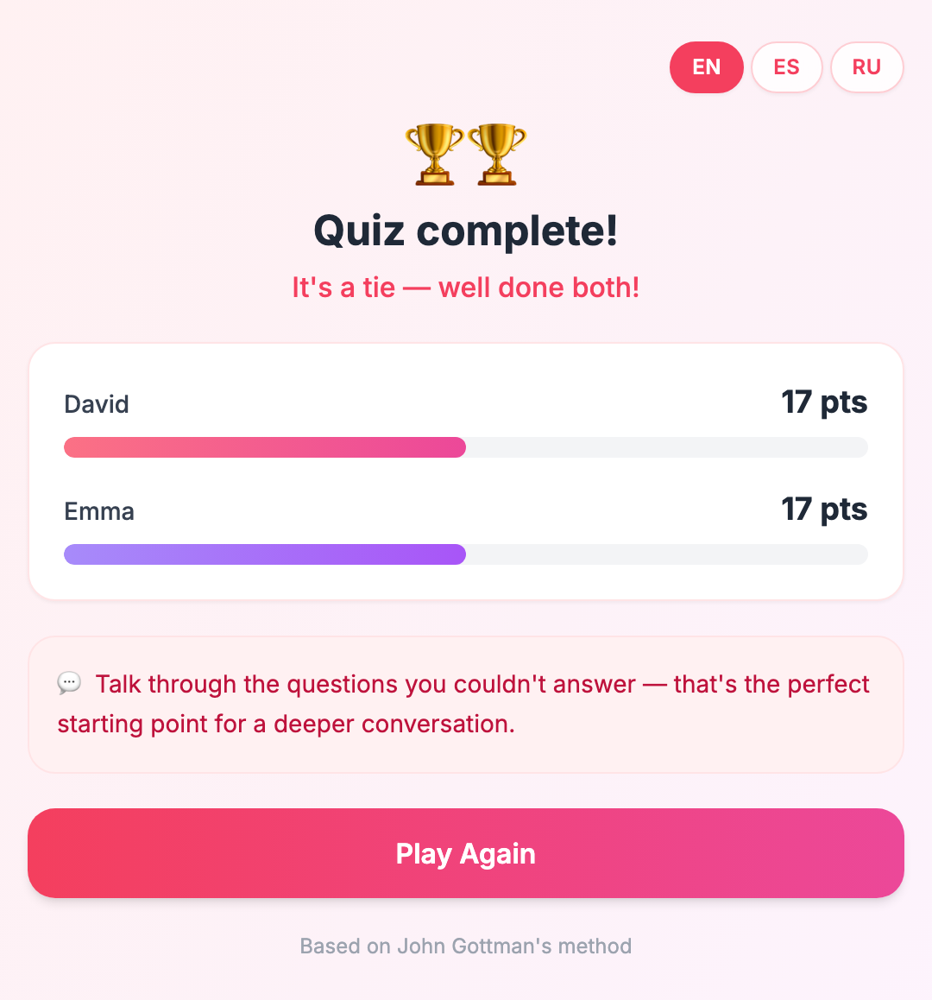

<div align="center">

# ❤️ Love Map

### How well do you *really* know your partner?

A bite-sized quiz game for couples, built on a peer-reviewed relationship framework —
turn 40 years of research into a 10-minute conversation.

**[▶️ Play it live](https://couple-question-tau.vercel.app/)** &nbsp;·&nbsp; 🇬🇧 English &nbsp;·&nbsp; 🇪🇸 Español &nbsp;·&nbsp; 🇷🇺 Русский

<br/>

&nbsp;
&nbsp;


</div>

---

## 📖 From a book to a product

This isn't a random quiz app. It's a small experiment in a bigger idea:

> **Take a well-researched book, extract the actual methodology, and ship it as a product people can use in one sitting.**

The source here is Dr. **John Gottman**'s *The Seven Principles for Making Marriage Work* — the culmination of decades of studying real couples in his "Love Lab." Principle #1 is building **Love Maps**: the detailed mental picture partners hold of each other's inner world — dreams, fears, values, everyday worries.

Gottman found that couples with rich Love Maps are measurably more resilient in hard times. He measured this with a "Love Map" questionnaire. **Love Map** takes that questionnaire off the page and turns it into a game you'd actually want to play on date night.

| The research says | The product does |
|---|---|
| Knowing your partner's world builds resilience | 62 questions pulled straight from Gottman's Love Map exercise |
| Not-knowing isn't failure — it's a prompt to talk | Wrong answers show *"Great topic to discuss!"* instead of a penalty |
| It's a two-way practice | Every question is asked in **both directions** — you take turns |
| Depth of knowledge varies by question | Questions are weighted **1–5 points** by how intimate they are |

The result is a product that's fun on the surface and quietly doing something useful underneath.

## ✨ Features

- **🎯 Faithful to the method** — 62 real Love Map questions, two-round turn-taking, and Gottman-style weighted scoring (the answerer earns the question's points, the asker earns 1 for a correct guess).
- **🌍 Trilingual** — full EN / ES / RU support, switchable on the fly. No reload.
- **👤 Personalized** — enter both names; every prompt reads *"David asks · Emma answers"*.
- **⏱️ Pick your depth** — 5 (quick), 10 (date night), 20 (full game), or 30 (deep dive) questions.
- **↩️ Undo-safe** — a back button rewinds the last answer *and* its score.
- **🎉 Delightful finish** — animated score bars, a winner (or a tie), and a confetti burst.
- **📱 Mobile-first** — designed phone-first for playing side by side on the couch.

## 🎮 How scoring works

Each question is played **twice** — once in each direction.

1. **David → Emma**: David reads the question, Emma answers out loud, David marks it right or wrong.
2. If **right** → Emma gets the question's difficulty points (1–5 ♥), David gets **+1** for asking a good question.
3. If **wrong** → nobody scores, and the app nudges you to *talk it through*.
4. Then you **switch roles** and repeat.

Higher-stakes questions ("What is my biggest unfulfilled dream?") are worth more than easy ones ("What's my favorite color?"), so knowing the deep stuff counts.

## 🛠️ Tech stack

| | |
|---|---|
| **Framework** | [Next.js 16](https://nextjs.org/) (App Router) |
| **UI** | [React 19](https://react.dev/) |
| **Styling** | [Tailwind CSS](https://tailwindcss.com/) |
| **Motion** | [Framer Motion](https://www.framer.com/motion/) + [canvas-confetti](https://github.com/catdad/canvas-confetti) |
| **i18n** | Lightweight custom dictionary (no runtime dependency) |
| **Hosting** | [Vercel](https://vercel.com/) |

Zero backend, zero database, zero tracking — everything runs client-side.

## 🚀 Run locally

```bash
git clone https://github.com/pavelpulso/couple-question.git
cd couple-question
npm install
npm run dev
```

Open [http://localhost:3000](http://localhost:3000).

```bash
npm run build && npm start   # production build
```

## 🗺️ Project structure

```
app/
  page.js            # screen state machine: landing → quiz → result
  layout.js          # metadata, global gradient
components/
  LandingScreen.js   # intro, names, question-count picker
  QuizScreen.js      # turn-taking flow + scoring engine
  ResultScreen.js    # score bars, winner, confetti
lib/
  questions.js       # 62 weighted Love Map questions (RU/EN)
  i18n.js            # EN / ES / RU dictionary
```

## 🙏 Credits & disclaimer

Questions and methodology adapted from **John M. Gottman & Nan Silver — *The Seven Principles for Making Marriage Work***. This is an independent, non-commercial fan project for entertainment; it is not affiliated with or endorsed by The Gottman Institute, and it is **not a substitute for professional relationship counseling**.

## 📄 License

MIT — see [`LICENSE`](LICENSE).

<div align="center">
<br/>
Made with ❤️ &nbsp;·&nbsp; <a href="https://couple-question-tau.vercel.app/">Play now</a>
</div>
